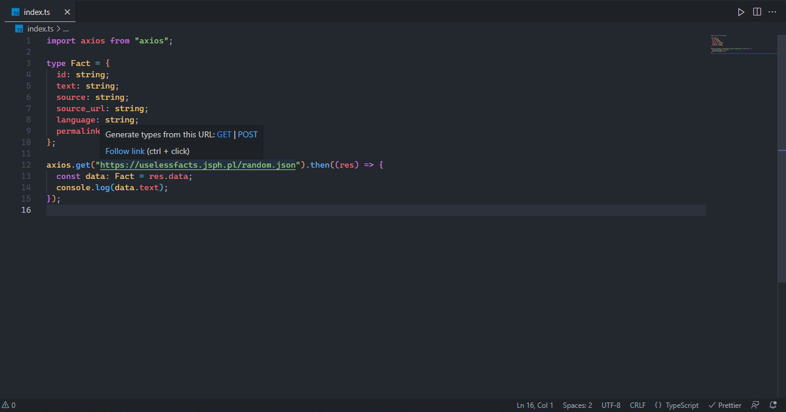

This extensions generates Typescript types based on any URL that has JSON as it's response.

## Usage

Hover over any link in a typescript (.ts or .tsx) file and when the popup appears on your cursor, click on the button "POST" to send a POST request to the hovered URL or click on the button "GET" to send a GET request to the hovered URL. The extension will then find the nearest empty line upwards and write in the generated type.

## Configuration

`"json-type-generator.arrayDeclarationAsBrackets": false`

By enabling this setting, arrays will be generated as `T[]` instead of `Array<T>`.
